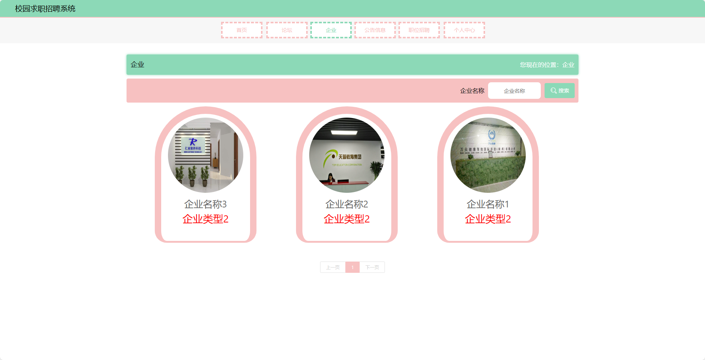

基于SpringBoot的校园求职招聘系统（程序+论文）
=
- 完整代码获取地址：从戎源码网 ([https://armycodes.com/](https://armycodes.com/))
- 作者微信：19941326836  QQ：952045282 
- 承接计算机毕业设计、Java毕业设计、Python毕业设计、深度学习、机器学习
- 选题+开题报告+任务书+程序定制+安装调试+论文+答辩ppt 一条龙服务

一、项目介绍
---
基于Spring Boot框架实现的校园求职招聘系统，系统包含两种角色：管理员、用户,系统分为前台和后台两大模块，主要功能如下。
### 【前台】：
- 首页：展示系统的概述和主要功能入口。
- 论坛：提供学生和企业用户交流的平台。
- 企业：展示注册的企业信息。
- 公告信息：管理员发布的校园求职相关公告和通知信息。
- 职位招聘：企业用户发布的招聘职位信息。
- 个人中心：
  - 简历：学生用户可以创建和管理个人简历。
  - 职位收藏：学生用户可以收藏感兴趣的职位。
  - 面试申请：学生用户可以查看已申请的面试职位和状态。

### 【后台】：
### 【管理员】：
- 个人中心：管理员可以查看和编辑个人信息。
- 管理员管理：管理员可以对其他管理员进行管理，包括添加、编辑和删除管理员账号。
- 企业管理：管理员可以管理注册的企业账号，包括查看企业信息、审核企业账号等操作。
- 用户管理：管理员可以管理学生用户账号，包括查看用户信息、禁用用户账号等操作。
- 简历管理：管理员可以查看学生用户的简历信息，并进行审核和管理。
- 职位招聘管理：管理员可以管理企业用户发布的招聘职位信息，包括审核发布、编辑和删除职位信息。
- 面试申请管理：管理员可以管理学生用户的面试申请，包括查看申请状态、安排面试等操作。
- 基础数据管理：管理员可以管理系统的基础数据，包括学校信息、专业信息等的添加、编辑和删除。
- 论坛管理：管理员可以管理系统的论坛信息，包括审核帖子、删除违规内容等操作。
- 公告信息管理：管理员可以发布和管理系统的校园求职公告信息，包括添加、编辑和删除公告。
- 轮播图信息：管理员可以管理首页的轮播图信息，包括添加、编辑和删除轮播图。

### 【企业】：
- 个人中心：企业用户可以查看和编辑个人信息。
- 简历管理：企业用户可以查看收到的学生用户投递的简历，并进行筛选和管理。
- 职位招聘管理：企业用户可以发布和管理招聘职位信息，包括添加、编辑和删除职位信息。
- 面试申请管理：企业用户可以查看收到的学生用户的面试申请，进行筛选和安排面试。
- 论坛管理：企业用户可以发布和管理论坛帖子，回答学生用户的问题和提供求职建议。
- 公告信息管理：企业用户可以发布和管理校园求职相关公告信息。

二、项目技术
---
- 编程语言：Java
- 数据库：MySQL
- 项目管理工具：Maven
- 前端技术：VUE、HTML、Jquery、Bootstrap
- 后端技术：Spring、SpringMVC、MyBatis

三、运行环境
---
- 操作系统：Windows、macOS都可以
- JDK版本：JDK1.8以上都可以
- 开发工具：IDEA、Ecplise、Myecplise都可以
- 数据库: MySQL5.7以上都可以
- Tomcat：任意版本都可以
- Maven：任意版本都可以

四、运行截图
---
### 论文截图：

### 程序截图：

